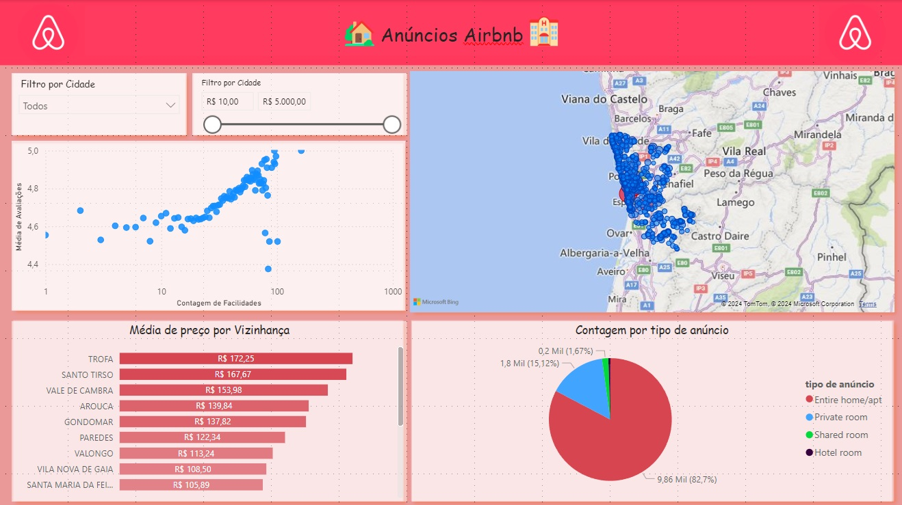

# Dashboards

This section showcases various interactive dashboards created using Power BI. Each dashboard visualizes different datasets and provides insights into various metrics, trends, and patterns. Explore the dashboards to see how data visualization can bring data to life and provide valuable insights.

## Projects

### [Airbnb](airbnb)

This project involves creating an interactive dashboard using Power BI to visualize Airbnb data for the city of Porto, Portugal. The dashboard provides insights into various aspects such as pricing trends, popular neighborhoods, and availability.

### [Pet Shop Dashboard](petshop)

This dashboard visualizes various metrics for a pet shop, including sales, revenue, filters and other insights. Also provides an interactive way to explore and analyze the data, helping to make informed business decisions.

